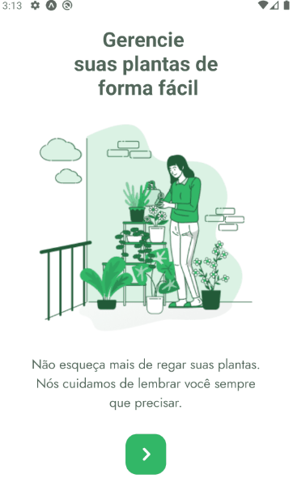
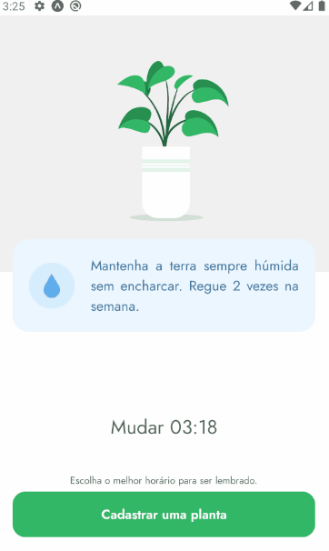
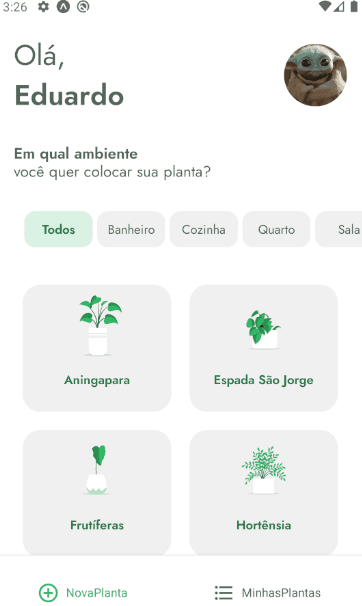

# PlantManager-NLW5
App desenvolvido e finalizado durante a NLW5 da Rocketseat que tem o intuito de ajudar pessoas a cuidar das suas plantinhas. Ele possibilita selecionar plantas e 
receber dicas de cuidados. Também é possivel salvar a planta no seu dispositivo e habilitar notificações para lembrar a hora de regar sua planta.

# About :
O aplicativo foi desenvolvido em React Native utilizando funcionalidades nativas do framework e libs externas. Optei por usar o ***styled-components*** no desenvolvimento, ao invés do stylesheet nativo utilizado na NLW5. Através de um arquivo JSON disponibilizado pela Rocketseat foi possível criar uma full fake ***REST API*** de desenvolvimento 
utilizando o <a href="https://github.com/typicode/json-server">***JSON-server***<a/> de onde foi consumido os dados. Utilizando o AsyncStorage e a API de notificações 
do EXPO foi implementado a função de salvar as plantas selecionadas no dispositivo do usuário e notifica-lo assim que necessário. O gerenciamento de páginas do app foi 
feito através do ***React Navigation***.

# Technologies:
- React Native
- Expo
- React Navigation
- styled-components
- AsyncStorage
- Expo Notifications
- axios
- JSON server
- Lottie (animações)

# Screens
## Welcome / Plant Select

## My Plants / Save Plant

